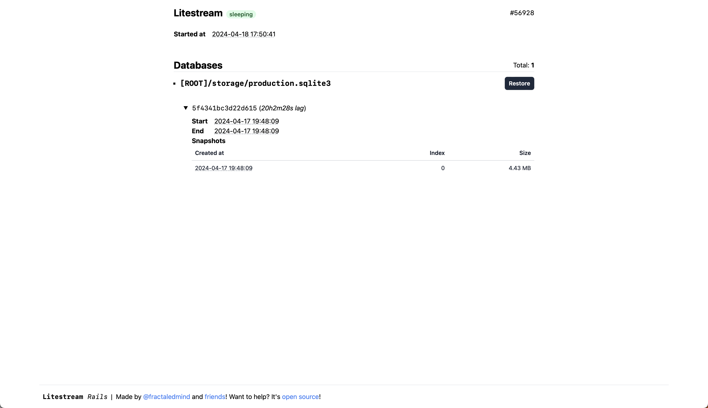

# litestream-ruby

<p>
  <a href="https://rubygems.org/gems/litestream">
  
  </a>
  <a href="https://rubygems.org/gems/litestream">
    
  </a>
  <a href="https://github.com/testdouble/standard">
    
  </a>
  <a href="https://github.com/fractaledmind/litestream-ruby/actions/workflows/main.yml">
    
  </a>
  <a href="https://github.com/sponsors/fractaledmind">
    
  </a>
  <a href="https://ruby.social/@fractaledmind">
    
  </a>
  <a href="https://twitter.com/fractaledmind">
    
  </a>
</p>

[Litestream](https://litestream.io/) is a standalone streaming replication tool for SQLite. This gem provides a Ruby interface to Litestream.

## Installation

Install the gem and add to the application's Gemfile by executing:

```sh
bundle add litestream
```

If bundler is not being used to manage dependencies, install the gem by executing:

```sh
gem install litestream
```

After installing the gem, run the installer:

```sh
rails generate litestream:install
```

The installer will create a configuration file at `config/litestream.yml` and an initializer file for configuring the gem at `config/initializers/litestream.rb`.

This gem wraps the standalone executable version of the [Litestream](https://litestream.io/install/source/) utility. These executables are platform specific, so there are actually separate underlying gems per platform, but the correct gem will automatically be picked for your platform. Litestream itself doesn't support Windows, so this gem doesn't either.

Supported platforms are:

- arm64-darwin (macos-arm64)
- x86_64-darwin (macos-x64)
- aarch64-linux (linux-aarch64)
- arm64-linux (linux-arm64)
- x86_64-linux (linux-x64)

### Using a local installation of `litestream`

If you are not able to use the vendored standalone executables (for example, if you're on an unsupported platform), you can use a local installation of the `litestream` executable by setting an environment variable named `LITESTREAM_INSTALL_DIR` to the directory containing the executable.

For example, if you've installed `litestream` so that the executable is found at `/usr/local/bin/litestream`, then you should set your environment variable like so:

```sh
LITESTREAM_INSTALL_DIR=/usr/local/bin
```

This also works with relative paths. If you've installed into your app's directory at `./.bin/litestream`:

```sh
LITESTREAM_INSTALL_DIR=.bin
```

## Usage

### Configuration

You configure the Litestream executable through the [`config/litestream.yml` file](https://litestream.io/reference/config/), which is a standard Litestream configuration file as if Litestream was running in a traditional installation.

The gem streamlines the configuration process by providing a default configuration file for you. This configuration file will backup all SQLite databases defined in your `config/database.yml` file to one replication bucket. In order to ensure that no secrets are stored in plain-text in your repository, this configuration file leverages Litestream's support for environment variables. The default configuration file looks like this if you only have one SQLite database:

```yaml
dbs:
  - path: storage/production.sqlite3
    replicas:
      - type: s3
        bucket: $LITESTREAM_REPLICA_BUCKET
        path: storage/production.sqlite3
        access-key-id: $LITESTREAM_ACCESS_KEY_ID
        secret-access-key: $LITESTREAM_SECRET_ACCESS_KEY
```

This is the default for Amazon S3. The full range of possible replica types (e.g. other S3-compatible object storage servers) are covered in Litestream's [replica guides](https://litestream.io/guides/#replica-guides).

The gem also provides a default initializer file at `config/initializers/litestream.rb` that allows you to configure these three environment variables referenced in the configuration file in Ruby. By providing a Ruby interface to these environment variables, you can use any method of storing secrets that you prefer. For example, the default generated file uses Rails' encrypted credentials to store your secrets:

```ruby
Rails.application.configure do
  litestream_credentials = Rails.application.credentials.litestream

  config.litestream.replica_bucket = litestream_credentials&.replica_bucket
  config.litestream.replica_key_id = litestream_credentials&.replica_key_id
  config.litestream.replica_access_key = litestream_credentials&.replica_access_key
end
```

However, if you need manual control over the Litestream configuration, you can manually edit the `config/litestream.yml` file. The full range of possible configurations are covered in Litestream's [configuration reference](https://litestream.io/reference/config/).  NB: If you configure a longer `sync-interval`, you may need to adjust `replication_sleep` when calling `Litestream.verify!`.

### Replication

In order to stream changes to your configured replicas, you need to start the Litestream replication process.

The simplest way to run the Litestream replication process is use the Puma plugin provided by the gem. This allows you to run the Litestream replication process together with Puma and have Puma monitor and manage it. You just need to add the following to your `puma.rb` configuration:

```ruby
# Run litestream only in production.
plugin :litestream if ENV.fetch("RAILS_ENV", "production") == "production"
```

If you would prefer to run the Litestream replication process separately from Puma, you can use the provided `litestream:replicate` rake task. This rake task will automatically load the configuration file and set the environment variables before starting the Litestream process.

The simplest way to spin up a Litestream process separately from your Rails application is to use a `Procfile`:

```yaml
# Procfile
rails: bundle exec rails server --port $PORT
litestream: bin/rails litestream:replicate
```

Alternatively, you could setup a `systemd` service to manage the Litestream replication process, but setting this up is outside the scope of this README.

If you need to pass arguments through the rake task to the underlying `litestream` command, that can be done with argument forwarding:

```shell
bin/rails litestream:replicate -- -exec "foreman start"
```

This example utilizes the `-exec` option available on [the `replicate` command](https://litestream.io/reference/replicate/) which provides basic process management, since Litestream will exit when the child process exits. In this example, we only launch our collection of Rails application processes (like Rails and SolidQueue, for example) after the Litestream replication process is ready.

The Litestream `replicate` command supports the following options, which can be passed through the rake task:

```shell
-config PATH
    Specifies the configuration file.
    Defaults to /etc/litestream.yml

-exec CMD
    Executes a subcommand. Litestream will exit when the child
    process exits. Useful for simple process management.

-no-expand-env
    Disables environment variable expansion in configuration file.
```

### Restoration

You can restore any replicated database at any point using the gem's provided `litestream:restore` rake task. This rake task requires that you specify which specific database you want to restore. As with the `litestream:replicate` task, you pass arguments to the rake task via argument forwarding. For example, to restore the production database, you would do the following:

> [!NOTE]  
> During the restoration process, you need to prevent any interaction with ActiveRecord/SQLite, such as from a running `rails server` or `rails console` instance. If there is any interaction, Rails might regenerate the production database and prevent restoration via litestream. If this happens, you might get a "cannot restore, output path already exists" error.

1. Rename the production (`production.sqlite3`, `production.sqlite3-shm`, and `production.sqlite3-wal`) databases (**recommended**) or alternatively delete. To delete the production databases locally, you can run the following at your own risk:
   ```shell
   # DANGEROUS OPERATION, consider renaming database files instead
   bin/rails db:drop DISABLE_DATABASE_ENVIRONMENT_CHECK=1
   ```

2. Run restore command:
   ```shell
   bin/rails litestream:restore -- --database=storage/production.sqlite3
   # or
   bundle exec rake litestream:restore -- --database=storage/production.sqlite3
   ```

3. Restart your Rails application or Docker container if applicable.

You can restore any of the databases specified in your `config/litestream.yml` file. The `--database` argument should be the path to the database file you want to restore and must match the value for the `path` key of one of your configured databases. The `litestream:restore` rake task will automatically load the configuration file and set the environment variables before calling the Litestream executable.

If you need to pass arguments through the rake task to the underlying `litestream` command, that can be done with additional forwarded arguments:

```shell
bin/rails litestream:restore -- --database=storage/production.sqlite3 --if-db-not-exists
```

You can forward arguments in whatever order you like, you simply need to ensure that the `--database` argument is present. You can also use either a single-dash `-database` or double-dash `--database` argument format. The Litestream `restore` command supports the following options, which can be passed through the rake task:

```shell
-o PATH
    Output path of the restored database.
    Defaults to original DB path.

-if-db-not-exists
    Returns exit code of 0 if the database already exists.

-if-replica-exists
    Returns exit code of 0 if no backups found.

-parallelism NUM
    Determines the number of WAL files downloaded in parallel.
    Defaults to 8

-replica NAME
    Restore from a specific replica.
    Defaults to replica with latest data.

-generation NAME
    Restore from a specific generation.
    Defaults to generation with latest data.

-index NUM
    Restore up to a specific WAL index (inclusive).
    Defaults to use the highest available index.

-timestamp TIMESTAMP
    Restore to a specific point-in-time.
    Defaults to use the latest available backup.

-config PATH
    Specifies the configuration file.
    Defaults to /etc/litestream.yml

-no-expand-env
    Disables environment variable expansion in configuration file.
```

### Verification

You can verify the integrity of your backed-up databases using the gem's provided `Litestream.verify!` method. The method takes the path to a database file that you have configured Litestream to backup; that is, it takes one of the `path` values under the `dbs` key in your `litestream.yml` configuration file. For example, to verify the production database, you would run:

```ruby
Litestream.verify! "storage/production.sqlite3"
```

In order to verify that the backup for that database is both restorable and fresh, the method will add a new row to that database under the `_litestream_verification` table, which it will create if needed. It will then wait `replication_sleep` seconds (defaults to 10) to give the Litestream utility time to replicate that change to whatever storage providers you have configured. After that, it will download the latest backup from that storage provider and ensure that this verification row is present in the backup. If the verification row is _not_ present, the method will raise a `Litestream::VerificationFailure` exception. This check ensures that the restored database file:

1. exists,
2. can be opened by SQLite, and
3. has up-to-date data.

After restoring the backup, the `Litestream.verify!` method will delete the restored database file. If you need the restored database file, use the `litestream:restore` rake task or `Litestream::Commands.restore` method instead.

### Dashboard

The gem provides a web dashboard for monitoring the status of your Litestream replication. To mount the dashboard in your Rails application, add the following to your `config/routes.rb` file:

```ruby
authenticate :user, -> (user) { user.admin? } do
  mount Litestream::Engine, at: "/litestream"
end
```

> [!NOTE]
> Be sure to [secure the dashboard](#authentication) in production.

#### Authentication

Litestream Rails does not restrict access out of the box. You must secure the dashboard yourself. However, it does provide basic HTTP authentication that can be used with basic authentication or Devise. All you need to do is setup a username and password.

There are two ways to setup a username and password. First, you can use the `LITESTREAM_USERNAME` and `LITESTREAM_PASSWORD` environment variables:

```ruby
ENV["LITESTREAM_USERNAME"] = "frodo"
ENV["LITESTREAM_PASSWORD"] = "ikeptmysecrets"
```

Second, you can configure the access credentials via the Rails configuration object, under the `litestream` key, in an initializer:

```ruby
# Set authentication credentials for Litestream
config.litestream.username = Rails.application.credentials.dig(:litestream, :username)
config.litestream.password = Rails.application.credentials.dig(:litestream, :password)
```

Either way, if you have set a username and password, Litestream will use basic HTTP authentication.

> [!IMPORTANT]
> If you have not set a username and password, Litestream will not require any authentication to view the dashboard.

If you use Devise for authentication in your app, you can also restrict access to the dashboard by using their `authenticate` constraint in your routes file:

```ruby
authenticate :user, -> (user) { user.admin? } do
  mount Litestream::Engine, at: "/litestream"
end
```

### Examples

There is only one screen in the dashboard.

- the show view of the Litestream replication process:



### Usage with API-only Applications

If your Rails application is an API-only application (generated with the `rails new --api` command), you will need to add the following middleware to your `config/application.rb` file in order to use the dashboard UI provided by Litestream:

```ruby
# /config/application.rb
config.middleware.use ActionDispatch::Cookies
config.middleware.use ActionDispatch::Session::CookieStore
config.middleware.use ActionDispatch::Flash
```

### Overwriting the views

You can find the views in [`app/views`](https://github.com/fractaledmind/litestream-ruby/tree/main/app/views).

```bash
app/views/
├── layouts
│   └── litestream
│       ├── _style.html
│       └── application.html.erb
└── litestream
    └── processes
        └── show.html.erb
```

You can always take control of the views by creating your own views and/or partials at these paths in your application. For example, if you wanted to overwrite the application layout, you could create a file at `app/views/layouts/litestream/application.html.erb`. If you wanted to remove the footer and the automatically disappearing flash messages, as one concrete example, you could define that file as:

```erb
<!DOCTYPE html>
<html>
  <head>
    <title>Litestream</title>
    <%= csrf_meta_tags %>
    <%= csp_meta_tag %>

    <%= render "layouts/litestream/style" %>
  </head>
  <body class="h-full flex flex-col">
    <main class="container mx-auto max-w-4xl mt-4 px-2 grow">
      <%= content_for?(:content) ? yield(:content) : yield %>
    </main>

    <div class="fixed top-0 left-0 right-0 text-center py-2">
      <% if notice.present? %>
        <p class="py-2 px-3 bg-green-50 text-green-500 font-medium rounded-lg inline-block">
          <%= notice %>
        </p>
      <% end %>

      <% if alert.present? %>
        <p class="py-2 px-3 bg-red-50 text-red-500 font-medium rounded-lg inline-block">
          <%= alert %>
        </p>
      <% end %>
    </div>
  </body>
</html>
```

### Introspection

Litestream offers a handful of commands that allow you to introspect the state of your replication. The gem provides a few rake tasks that wrap these commands for you. For example, you can list the databases that Litestream is configured to replicate:

```shell
bin/rails litestream:databases
```

This will return a list of databases and their configured replicas:

```
path                                                 replicas
/Users/you/Code/your-app/storage/production.sqlite3  s3
```

You can also list the generations of a specific database:

```shell
bin/rails litestream:generations -- --database=storage/production.sqlite3
```

This will list all generations for the specified database, including stats about their lag behind the primary database and the time range they cover:

```
name  generation        lag     start                 end
s3    a295b16a796689f3  -156ms  2024-04-17T00:01:19Z  2024-04-17T00:01:19Z
```

You can list the snapshots available for a database:

```shell
bin/rails litestream:snapshots -- --database=storage/production.sqlite3
```

This command lists snapshots available for that specified database:

```
replica  generation        index  size     created
s3       a295b16a796689f3  1      4645465  2024-04-17T00:01:19Z
```

Finally, you can list the wal files available for a database:

```shell
bin/rails litestream:wal -- --database=storage/production.sqlite3
```

This command lists wal files available for that specified database:

```
replica  generation        index  offset    size     created
s3       a295b16a796689f3  1      0         2036     2024-04-17T00:01:19Z
```

### Running commands from Ruby

In addition to the provided rake tasks, you can also run Litestream commands directly from Ruby. The gem provides a `Litestream::Commands` module that wraps the Litestream CLI commands. This is particularly useful for the introspection commands, as you can use the output in your Ruby code.

The `Litestream::Commands.databases` method returns an array of hashes with the "path" and "replicas" keys for each database:

```ruby
Litestream::Commands.databases
# => [{"path"=>"/Users/you/Code/your-app/storage/production.sqlite3", "replicas"=>"s3"}]
```

The `Litestream::Commands.generations` method returns an array of hashes with the "name", "generation", "lag", "start", and "end" keys for each generation:

```ruby
Litestream::Commands.generations('storage/production.sqlite3')
# => [{"name"=>"s3", "generation"=>"5f4341bc3d22d615", "lag"=>"3s", "start"=>"2024-04-17T19:48:09Z", "end"=>"2024-04-17T19:48:09Z"}]
```

The `Litestream::Commands.snapshots` method returns an array of hashes with the "replica", "generation", "index", "size", and "created" keys for each snapshot:

```ruby
Litestream::Commands.snapshots('storage/production.sqlite3')
# => [{"replica"=>"s3", "generation"=>"5f4341bc3d22d615", "index"=>"0", "size"=>"4645465", "created"=>"2024-04-17T19:48:09Z"}]
```

The `Litestream::Commands.wal` method returns an array of hashes with the "replica", "generation", "index", "offset","size", and "created" keys for each wal:

```ruby
Litestream::Commands.wal('storage/production.sqlite3')
# => [{"replica"=>"s3", "generation"=>"5f4341bc3d22d615", "index"=>"0",  "offset"=>"0", "size"=>"2036", "created"=>"2024-04-17T19:48:09Z"}]
```

You can also restore a database programmatically using the `Litestream::Commands.restore` method, which returns the path to the restored database:

```ruby
Litestream::Commands.restore('storage/production.sqlite3')
# => "storage/production-20240418090048.sqlite3"
```

You _can_ start the replication process using the `Litestream::Commands.replicate` method, but this is not recommended. The replication process should be managed by Litestream itself, and you should not need to manually start it.

### Running commands from CLI

The rake tasks are the recommended way to interact with the Litestream utility in your Rails application or Ruby project. But, you _can_ work directly with the Litestream CLI. Since the gem installs the native executable via Bundler, the `litestream` command will be available in your `PATH`.

The full set of commands available to the `litestream` executable are covered in Litestream's [command reference](https://litestream.io/reference/), but can be summarized as:

```shell
litestream databases [arguments]
litestream generations [arguments] DB_PATH|REPLICA_URL
litestream replicate [arguments]
litestream restore [arguments] DB_PATH|REPLICA_URL
litestream snapshots [arguments] DB_PATH|REPLICA_URL
litestream version
litestream wal [arguments] DB_PATH|REPLICA_URL
```

### Using in development

By default, if you install the gem and configure via `puma.rb` or `Procfile`, Litestream will not start in development.

If you setup via `puma.rb`, then remove the conditional statement.

If you setup via `Procfile`, you will need to update your `Procfile.dev` file. If you would like to test that your configuration is properly setup, you can manually add the `litestream:replicate` rake task to your `Procfile.dev` file. Just copy the `litestream` definition from the production `Procfile`.

In order to have a replication bucket for Litestream to point to, you can use a Docker instance of [MinIO](https://min.io/). MinIO is an S3-compatible object storage server that can be run locally. You can run a MinIO server with the following command:

```sh
docker run -p 9000:9000 -p 9001:9001 minio/minio server /data --console-address ":9001"
```

This gets us up and running quickly but it will only persist the data for as long as the Docker container is running, which is fine for local development testing.

To simplify local development, you can add this command to your `Procfile.dev` file as well. This would allow you to start a MinIO server and a Litestream replication process in your local development environment with the single `bin/dev` command.

Once you have a MinIO server running, you can create a bucket for Litestream to use. You can do this by visiting the MinIO console at [http://localhost:9001](http://localhost:9001) and logging in with the default credentials of `minioadmin` and `minioadmin`. Once logged in, you can create a bucket named `mybkt` by clicking the `+` button in the bottom right corner of the screen. You can then use the following configuration in your `config/initializers/litestream.rb` file:

```ruby
Litestream.configure do |config|
  config.replica_bucket = "s3://mybkt.localhost:9000/"
  config.replica_key_id = "minioadmin"
  config.replica_access_key = "minioadmin"
end
```

With Litestream properly configured and the MinIO server and Litestream replication process running, you should see something like the following in your terminal logs when you start the `bin/dev` process:

```sh
time=YYYY-MM-DDTHH:MM:SS level=INFO msg=litestream version=v0.3.xx
time=YYYY-MM-DDTHH:MM:SS level=INFO msg="initialized db" path=/path/to/your/app/storage/development.sqlite3
time=YYYY-MM-DDTHH:MM:SS level=INFO msg="replicating to" name=s3 type=s3 sync-interval=1s bucket=mybkt path="" region=us-east-1 endpoint=http://localhost:9000
```

## Development

After checking out the repo, run `bin/setup` to install dependencies. Then, run `rake test` to run the tests. You can also run `bin/console` for an interactive prompt that will allow you to experiment.

To install this gem onto your local machine, run `bundle exec rake install`.

For maintainers, to release a new version, run `bin/release $VERSION`, which will create a git tag for the version, push git commits and tags, and push all of the platform-specific `.gem` files to [rubygems.org](https://rubygems.org).

## Contributing

Bug reports and pull requests are welcome on GitHub at https://github.com/fractaledmind/litestream-ruby. This project is intended to be a safe, welcoming space for collaboration, and contributors are expected to adhere to the [code of conduct](https://github.com/fractaledmind/litestream-ruby/blob/main/CODE_OF_CONDUCT.md).

## License

The gem is available as open source under the terms of the [MIT License](https://opensource.org/licenses/MIT).

## Code of Conduct

Everyone interacting in the Litestream project's codebases, issue trackers, chat rooms and mailing lists is expected to follow the [code of conduct](https://github.com/fractaledmind/litestream-ruby/blob/main/CODE_OF_CONDUCT.md).
